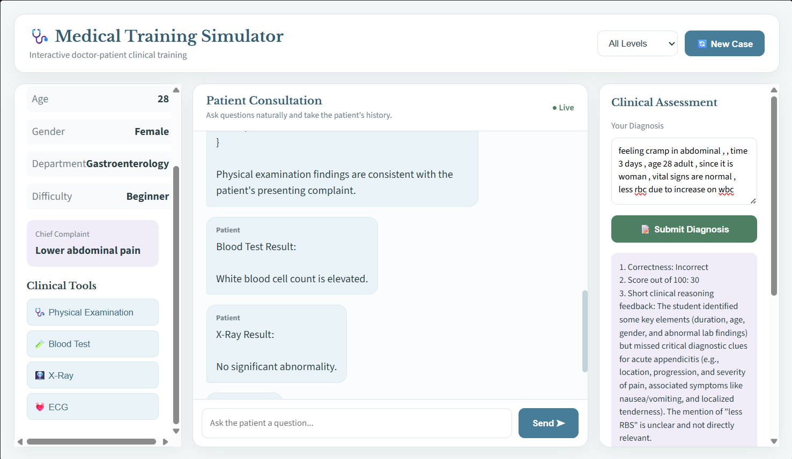
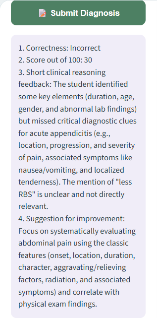
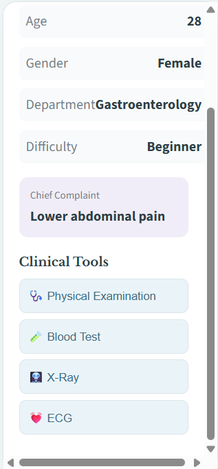

# 🩺 AI-Based Medical Training Simulator

<p align="center">


</p>

---

# 📖 Overview

The **AI-Based Medical Training Simulator** is an interactive web application that provides realistic virtual patient consultations for medical students.

The simulator uses **Generative AI** to create diverse patient scenarios, allowing students to:

- Interview virtual patients
- Request clinical investigations
- Analyze medical findings
- Submit diagnoses
- Receive AI-generated clinical feedback

This project helps students improve **clinical reasoning**, **history taking**, **diagnostic skills**, and **decision making** in a safe learning environment.

---

# ✨ Features

- 🩺 AI-generated patient cases
- 💬 Interactive doctor–patient conversation
- 🧑 Different medical departments
- 📈 Multiple difficulty levels
- 🧪 Clinical investigation tools
  - Physical Examination
  - Blood Test
  - X-Ray
  - ECG
- 📝 Diagnosis submission
- 📊 Automatic evaluation
- 🎯 Clinical reasoning feedback
- 📱 Responsive modern interface

---

# 🏗️ System Architecture

```
Medical Student
       │
       ▼
 Flask Web Application
       │
       ▼
 Generative AI (Gemini API)
       │
       ▼
 Patient Scenario Generator
       │
       ▼
 Interactive Consultation
       │
       ▼
 Investigation Module
       │
       ▼
 Diagnosis Evaluation
       │
       ▼
 AI Feedback & Score
```

---

# 💻 Technology Stack

| Category | Technologies |
|-----------|--------------|
| Backend | Python, Flask |
| Frontend | HTML, CSS, JavaScript |
| AI | MISTRAL API |
| Version Control | Git & GitHub |
| IDE | Visual Studio Code |

---

# 📂 Project Structure

```
Medical-Training-Simulator/

│── app.py
│── requirements.txt
│── README.md
│── .gitignore
│
├── templates/
│      └── index.html
│
├── static/
│      ├── style.css
│      ├── script.js
│      └── images/
│
├── screenshots/
│      ├── dashboard.png
│      ├── patient_chat1.png
│      ├── patient_chat2.png
│      ├── diagnosis.png
│      └── case_selection.png
│
├── report/
│      └── Project_Report.pdf
│
├── prompts/
│
└── sample_io/
```

---

# 🚀 Installation

Clone the repository

```bash
git clone https://github.com/SyedAbuthahir2005/Medical-Training-Simulator.git
```

Move into the project

```bash
cd Medical-Training-Simulator
```

Create virtual environment

```bash
python -m venv venv
```

Activate

Windows

```bash
venv\Scripts\activate
```

Install dependencies

```bash
pip install -r requirements.txt
```

Run

```bash
python app.py
```

Open

```
http://127.0.0.1:5000
```

---

# 📸 Application Screenshots

## 🏠 Dashboard

The simulator dashboard displaying patient information, consultation panel, investigation tools, and diagnosis evaluation.



---

## 💬 Patient Consultation

Students can communicate naturally with the AI-generated patient to collect medical history.


---

## 🩺 Physical Examination Results

Students can request physical examination findings before making a diagnosis.



---

## 📝 Diagnosis Evaluation

After submitting a diagnosis, the AI evaluates the student's clinical reasoning and provides a score with detailed feedback.


---

## 🏥 Case Selection

Each case includes:

- Patient Age
- Gender
- Department
- Difficulty Level
- Chief Complaint
- Clinical Investigation Tools



---

# 🧪 Clinical Workflow

1. Generate a new patient case.
2. Review patient demographics.
3. Interview the patient.
4. Request investigations.
5. Analyze examination results.
6. Submit diagnosis.
7. Receive AI-generated evaluation.
8. Learn from clinical feedback.

---

# 📝 Sample Input

```
Patient

Female

Age: 28

Chief Complaint

Lower abdominal pain

Duration

3 days

Requested Tests

Physical Examination

Blood Test

X-Ray
```

---

# 📤 Sample Output

```
Diagnosis Evaluation

Correctness:
Incorrect

Score:
30 / 100

Clinical Feedback

• Missing important diagnostic clues

• Consider pain location

• Associated symptoms

• Physical examination findings

Suggested Improvement

Use a systematic approach while evaluating abdominal pain.
```

---

# 🎯 Learning Outcomes

This simulator helps students practice

- Clinical history taking
- Diagnostic reasoning
- Differential diagnosis
- Investigation selection
- Medical decision making
- AI-assisted medical education

---

# 🔮 Future Enhancements

- 🎤 Voice-based consultation
- 🩻 Medical image interpretation
- 📈 Student performance analytics
- 🌍 Multi-language support
- ☁️ Cloud deployment
- 👨‍⚕️ Faculty dashboard
- 📱 Mobile application

---

# 👨‍💻 Author

**Syed Abuthahir**

3RD Year Biomedical Engineering Student

Dr. N.G.P Institute of Technology

---

# 📜 License

This project is developed for **academic and educational purposes**.

MIT License.

---

<p align="center">

⭐ If you found this project useful, please consider giving it a **Star** on GitHub.

</p>
